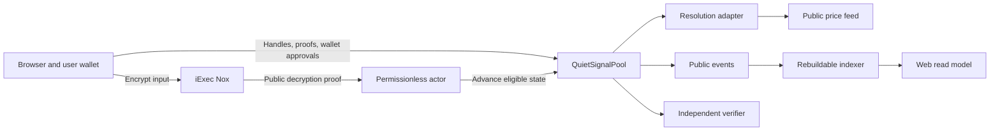
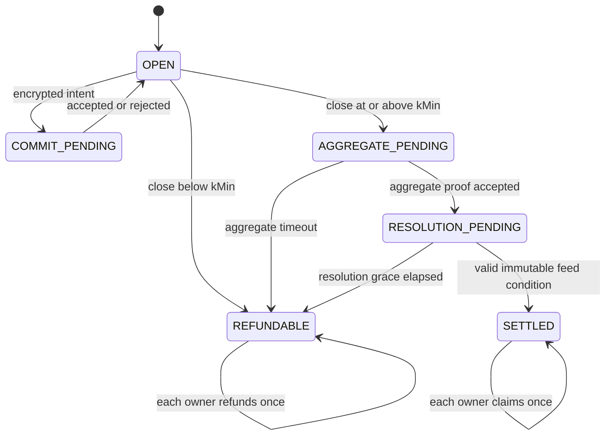

# QuietSignal

QuietSignal is a confidential forecasting protocol for public binary markets. A
participant submits an encrypted probability and collateral amount; once the cohort
reaches its on-chain privacy threshold, the protocol reveals only the aggregate
signal needed by the market. Individual forecasts, position sizes, payouts, and
calibration scores remain owner-scoped.

The system is a browser-first dApp backed by Ethereum Sepolia contracts and iExec
Nox confidential computation. It has no application backend with custody or access
to confidential inputs. Public resolution is isolated behind a zero-custody adapter,
while contracts enforce lifecycle transitions, access control, accounting, and
recovery.

Try the production application at
[quitesignal.vercel.app](https://quitesignal.vercel.app).

## Quickstart

### Requirements

- Node.js `24.18.0`
- npm `11.16.0`
- Git
- Internet access to Ethereum Sepolia
- An EIP-1193 wallet on Sepolia only if you want to submit transactions

The exact Node version is recorded in `.nvmrc`, and the exact dependency graph is
locked in `package-lock.json`.

### Install and run

```sh
git clone https://github.com/thatnghiepfulltime67/QuiteSignal.git
cd QuiteSignal
nvm install
nvm use
npm ci
cp .env.example .env
npm run doctor
npm run dev:web
```

Open <http://localhost:5173>. The app loads the published Sepolia release manifest
and reads live public chain state; it does not require a local blockchain or seeded
application state. `npm run doctor` uses a public Sepolia RPC when
`SEPOLIA_RPC_URL` is not configured.

For a quick source verification:

```sh
npm run check:offline
npm run test:web
npm run test:interfaces
npm run build:web
```

All contract, Nox, ACL, confidential-asset, lifecycle, recovery, and browser
acceptance evidence must run on Ethereum Sepolia. Local checks are intentionally
limited to compilation, static analysis, pure models, deterministic UI behavior,
schemas, formatting, and secret scanning.

## Why QuietSignal

Public on-chain markets expose wallet membership, timing, side, and size. That can
discourage informed participants from sharing forecasts about sensitive subjects:
their signal can be copied, profiled, or tied to a public identity.

QuietSignal separates private contribution from public utility:

- the browser encrypts the probability forecast and collateral amount before any
  transaction is submitted;
- the pool accepts fixed-shape encrypted inputs and maintains confidential owner
  ledgers;
- an on-chain `kMin` gate prevents aggregate disclosure for a cohort that is too
  small;
- only proof-verified YES and NO aggregate totals become public after the gate;
- an immutable public price-feed condition resolves the binary outcome; and
- each owner privately reveals their position, payout, and Brier score through the
  documented ACL path.

The MVP intentionally uses one pool for one market and one epoch. A new cohort or
condition is a new factory-deployed pool, avoiding shared cross-epoch accounting.

## How it works



### 1. Prepare and commit

The user selects a verified pool, obtains the Sepolia test collateral when needed,
and enters a probability plus an amount. The browser validates both values and asks
Nox to create pool- and chain-bound encrypted handles. The wallet explicitly
approves every asset and pool transaction.

The commit is a two-step confidential flow. `commitSignal` records one bounded
encrypted intent, then the unchanged collateral callback proves the received amount
without exposing it. A permissionless proof finalization accepts or rejects the
intent. One address can commit once per epoch.

### 2. Apply the cohort gate

After the commit deadline, anyone may close the epoch:

- if the participant count is below `kMin`, the pool becomes refundable and does
  not reveal an aggregate;
- if the threshold is met, the pool requests public decryption only for the
  aggregate YES and NO handles.

No user-specific forecast, amount, payout, or score is approved for public
decryption.

### 3. Finalize aggregate and resolve

A permissionless actor submits the aggregate proof bound to the pool and request.
The pool verifies it, records the public aggregate, and waits for the immutable
observation condition. The adapter reads the configured public price feed and
returns a binary result. It cannot receive collateral, choose an arbitrary result,
or access confidential owner handles.

### 4. Claim or recover

After settlement, the owner may reveal their owner-scoped position, materialize an
encrypted Brier score, and claim once. Payout uses the owner's confidential winning
allocation and the public winning aggregate:

```text
ownerPayout = totalCollateral × ownerWinningAllocation / winningAggregate
```

For a public result `y` and an owner-only forecast `p`, both in basis points:

```text
errorBps = abs(p - y)
brierLossBps = errorBps² / 10_000
scoreBps = 10_000 - brierLossBps
```

Below-threshold epochs, aggregate timeouts, and resolution-grace expiry lead to
contract-defined refund paths. Relayers and indexers improve convenience but are not
required for correctness, claims, or recovery.

## Protocol lifecycle



| State                | Funds location                                                  | Available progress or recovery                                     |
| -------------------- | --------------------------------------------------------------- | ------------------------------------------------------------------ |
| `OPEN`               | Owner custody or confidential pool after an accepted commit     | Commit until the deadline, then permissionless close               |
| `COMMIT_PENDING`     | Owner custody or conditionally transferred encrypted collateral | Permissionless proof finalization, rejection, or timeout return    |
| `AGGREGATE_PENDING`  | Confidential pool                                               | Submit the bound aggregate proof or wait for timeout refund        |
| `RESOLUTION_PENDING` | Confidential pool                                               | Resolve from the immutable feed or enter refund after grace expiry |
| `SETTLED`            | Confidential payout pot                                         | Each owner claims exactly once                                     |
| `REFUNDABLE`         | Confidential pool                                               | Each owner refunds exactly once                                    |

## Privacy and trust model

QuietSignal is confidential, not anonymous. It protects forecast content and amount
under the documented Nox and ACL path; it does not hide normal public-chain
metadata.

| Data                                                               | Visibility                         |
| ------------------------------------------------------------------ | ---------------------------------- |
| Market condition, pool configuration, deadlines, adapter, and feed | Public                             |
| Sender, transaction hash, gas, timing, and cohort membership       | Public                             |
| Encrypted handle and proof bytes                                   | Public but opaque                  |
| Stake, probability, salt, owner allocation, payout, and score      | Confidential / owner-scoped        |
| Aggregate YES and NO totals                                        | Public only after the `kMin` gate  |
| Outcome, total pot, and payout rate                                | Public for settlement auditability |

The core guarantees are:

- no plaintext confidential input belongs in calldata, events, storage, application
  logs, analytics, or committed evidence;
- public decryption is limited to aggregate handles and protocol-required burn
  handles;
- owner viewer access is not granted to keepers, indexers, relayers, adapters, or an
  application server;
- adapter spend and all terminal payouts/refunds are conservation-bounded; and
- every pending state has a documented funds location and recovery transition.

The residual assumptions are explicit: Nox gateway/TEE behavior is a trust input,
wallet and transaction metadata stay public, `kMin` is not Sybil resistance, the
configured price feed is an external data dependency, and loss of the owner wallet
cannot be repaired by an application operator.

See [the privacy and threat model](docs/architecture/02-privacy-and-threat-model.md)
and [security policy](docs/security.md) for the normative boundaries.

## Application routes

| Route                   | Purpose                                                                        |
| ----------------------- | ------------------------------------------------------------------------------ |
| `/`                     | Product overview and verified release entry point                              |
| `/markets`              | Browse the canonical and verified self-test pools                              |
| `/pool/:address/signal` | Validate, encrypt, approve, and submit a signal                                |
| `/position`             | Read masked owner state, reveal privately, materialize score, claim, or refund |
| `/portfolio`            | Review the connected wallet's available pool journeys                          |
| `/verify/:address`      | Inspect manifest binding, runtime, lifecycle, and public verification facts    |
| `/lifecycle`            | View and submit contract-eligible permissionless lifecycle actions             |
| `/self-test`            | Create, discover, join, and exercise a fresh verified Sepolia test pool        |

The UI discovers EIP-6963/EIP-1193 wallets, enforces Sepolia, re-reads state after
receipts, handles account and chain changes, and presents direct-read recovery when
optional services are unavailable. Confidential form values and decrypted owner
values remain in browser memory only for the active interaction.

## Architecture and repository layout

| Area                          | Responsibility                                                                    | Explicitly does not own                                 |
| ----------------------------- | --------------------------------------------------------------------------------- | ------------------------------------------------------- |
| `apps/web`                    | Routes, wallet interaction, client encryption, owner views, recovery UX           | Settlement truth, server-side plaintext, wallet custody |
| `modules/protocol`            | Solidity pool, factory, collateral, adapter, deployment and Sepolia tests         | UI state and gateway orchestration                      |
| `modules/confidential-client` | Framework-independent encryption, proof packing, transaction and ACL-safe helpers | Wallet keys and product policy                          |
| `modules/domain`              | Pure lifecycle model, math, schemas, and error taxonomy                           | RPC or wallet side effects                              |
| `modules/verifier`            | Independent recomputation from manifests, code, receipts, and public state        | Signers, confidential inputs, privileged calls          |
| `services/automation`         | Optional permissionless lifecycle advancement                                     | Plaintext, custody, exclusive authority                 |
| `services/indexer`            | Rebuildable public-event read model                                               | Private decryption and source-of-truth status           |
| `ops/scripts`                 | Preflight, budget, evidence, and release orchestration                            | Runtime protocol authority                              |

```text
.
├── apps/web/                    # Browser dApp
├── modules/
│   ├── confidential-client/     # Nox and wallet-facing SDK
│   ├── domain/                  # Pure state and accounting model
│   ├── protocol/                # Contracts, Hardhat, deployment, Sepolia tests
│   └── verifier/                # Independent read-only verification
├── services/
│   ├── automation/              # Optional permissionless worker
│   └── indexer/                 # Rebuildable public read model
├── deployments/sepolia/         # Append-only public manifests and active pointer
├── evidence/                    # Sanitized gate and receipt evidence
├── docs/                        # Product, architecture, engineering, plans, runbooks
├── ops/scripts/                 # Operational checks and guarded commands
├── DESIGN.md                    # UI semantics and accessibility rules
└── Plan.md                      # Execution and gate source of truth
```

Dependencies flow from pure domain logic toward protocol clients, services, and the
web app. The verifier remains independent of protocol accounting helpers so it can
recompute claims from public facts rather than trusting the implementation it
checks.

## Configuration

Copy `.env.example` to the ignored `.env` file. UI-only development can leave every
secret field empty.

| Variable                         | Required for                                                   | Notes                                                                 |
| -------------------------------- | -------------------------------------------------------------- | --------------------------------------------------------------------- |
| `SEPOLIA_RPC_URL`                | Optional read override; required by selected protocol commands | Must report chain ID `11155111`; never commit private RPC credentials |
| `SEPOLIA_PRIVATE_KEY`            | Explicitly named Sepolia write scripts only                    | Use a disposable, testnet-only key; never use a valuable wallet       |
| `CONFIRM_SEPOLIA_WRITE`          | Sepolia writes                                                 | Must be `yes` after reviewing the dry-run plan                        |
| `SEPOLIA_MAX_TOTAL_SPEND_ETH`    | Write budget                                                   | Hard cumulative ceiling enforced against the committed ledger         |
| `SEPOLIA_MAX_SINGLE_TX_ETH`      | Write budget                                                   | Per-transaction ceiling                                               |
| `SEPOLIA_FINALITY_CONFIRMATIONS` | Receipt handling                                               | Required confirmation depth                                           |
| `SEPOLIA_ACTOR_MNEMONIC`         | Optional multi-wallet test runner                              | Test-only and never committed; generated ignored actors are supported |
| `ETHERSCAN_API_KEY`              | Optional source verification                                   | Not needed for normal app use                                         |

Never paste a private key, seed phrase, confidential value, raw handle, proof,
signature, or authenticated RPC URL into source, logs, screenshots, issues, or
evidence. See [the Sepolia safety runbook](docs/setup-sepolia.md) before any write.

## Common commands

### Development and build

```sh
npm run dev:web       # Start the Vite development server
npm run build:web     # Create the production web bundle
npm run typecheck     # Run strict workspace TypeScript checks
npm run compile       # Compile Solidity and typecheck the workspace
npm run format:check  # Check committed formatter targets
```

### Offline and read-only verification

```sh
npm run check:offline          # Compile, lint, package tests, and secret scan
npm run test:web               # UI state, accessibility, and route tests
npm run test:interfaces        # Solidity interface and artifact assertions
npm run test:model             # Pure accounting and state-machine models
npm run scan:dependencies      # Dependency advisory and license inventory
npm run check:sepolia:read     # Doctor plus spend-ledger validation
npm run rebuild:indexer:sepolia
```

### Independent deployment verification

```sh
npm run verify:protocol:sepolia -- \
  --manifest=deployments/sepolia/releases/DEP-02.json \
  --out=evidence/sepolia/G6/DEP-02-verification.json
```

The verifier accepts public manifests and public RPC data only. It has no signer or
write path and checks runtime hashes, immutable bindings, deployment receipts,
collateral interfaces, adapter configuration, feed state, and custody boundaries.

### Sepolia writes

Write commands are deliberately separate from read commands. They require the exact
chain, an explicit confirmation flag, a clean eligible source state, gas estimation,
the per-write limit, and the committed cumulative spend ledger. Always read
[verification](docs/verification.md) and
[Sepolia setup](docs/setup-sepolia.md) before using them.

```sh
npm run budget:status
npm run deploy:sepolia:plan -- --release=DEP-<next-id>
CONFIRM_SEPOLIA_WRITE=yes npm run deploy:sepolia:write -- --release=DEP-<same-id>
```

Do not use a local blockchain or local Nox stack as contract or privacy evidence.

## Deployments and release manifests

Sepolia deployments are append-only. Each release manifest records its source
checkpoint, deployment block, contract addresses, runtime and creation-code hashes,
immutable configuration, pool bindings, and successful transaction receipts.

- `deployments/sepolia/active-release.json` is the small public pointer consumed by
  the application.
- `deployments/sepolia/releases/` contains immutable release manifests.
- `deployments/sepolia/verified-self-test-pools.json` contains public pools admitted
  by the same binding checks.

The frontend is deployed through `vercel.json`, which builds the web workspace and
rewrites direct routes to the SPA entry point. The complete release procedure is in
[deployment.md](docs/deployment.md).

## Verification and evidence

QuietSignal uses named gates rather than treating code presence as proof. Sanitized
evidence under `evidence/` records public transaction receipts, runtime hashes,
manifest bindings, invariant results, and verification outputs without private
inputs or wallet credentials.

The authoritative references are:

- [Plan.md](Plan.md) for current work-package and gate status;
- [evidence ledger](docs/plans/evidence-ledger.md) for gate-to-artifact mapping;
- [verification matrix](docs/plans/verification-matrix.md) for command scope;
- [traceability matrix](docs/plans/traceability-matrix.md) for requirements,
  privacy claims, and invariants; and
- [verification guide](docs/verification.md) for independent checks.

Operator browser attestations and machine-verifiable evidence remain distinct. This
keeps public claims bounded to exactly what each artifact demonstrates.

## Recovery and optional services

The automation worker and indexer are optional and replaceable:

- lifecycle transitions are permissionless where safe;
- the browser can fall back to direct public contract reads;
- the indexer can be rebuilt deterministically from finalized events;
- failed or stale optional services cannot gain owner access or move funds; and
- every non-terminal contract state documents where funds remain and which timeout
  or transaction can advance it.

Operational procedures are documented in the
[recovery runbook](docs/runbooks/recovery.md) and
[automation runbook](docs/runbooks/automation.md).

## Documentation map

- [Product brief](docs/product/00-executive-brief.md) — problem, product, and MVP
  boundary
- [Product specification](docs/product/03-product-spec.md) — functional and
  non-functional requirements
- [System architecture](docs/architecture/01-system-architecture.md) — components,
  trust boundaries, and lifecycle
- [Data and control flows](docs/architecture/03-data-and-control-flows.md) — commit,
  aggregation, resolution, payout, and ACL details
- [Protocol specification](docs/engineering/01-protocol-spec.md) — normative contract
  behavior and invariants
- [API and events](docs/engineering/02-api-and-events.md) — public interfaces and
  event semantics
- [Setup](docs/setup.md) and [usage](docs/usage.md) — developer and user workflows
- [Design system](DESIGN.md) — responsive, accessibility, visual, and motion rules
- [Risk register](docs/operations/02-risk-register.md) — threats, mitigations, and
  stop-ship conditions
- [Nox integration feedback](feedback.md) — detailed competition feedback and
  integration findings

## Development workflow

Use [Plan.md](Plan.md) as the execution source of truth. Work on one independently
reviewable item at a time, run the narrowest relevant checks followed by its required
gate, update behavior and documentation together, and keep unrelated changes out of
the commit. Architecture changes that alter trust, custody, privacy, state
transitions, or public interfaces require a decision record before implementation.

Security-sensitive reports should be shared privately with the repository owner.
Never open a public report containing keys, confidential values, proofs, signatures,
authenticated endpoints, or unsanitized traces.

## License

QuietSignal is available under the [MIT License](LICENSE).
