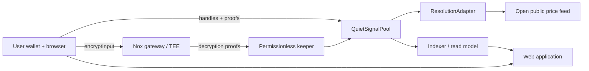
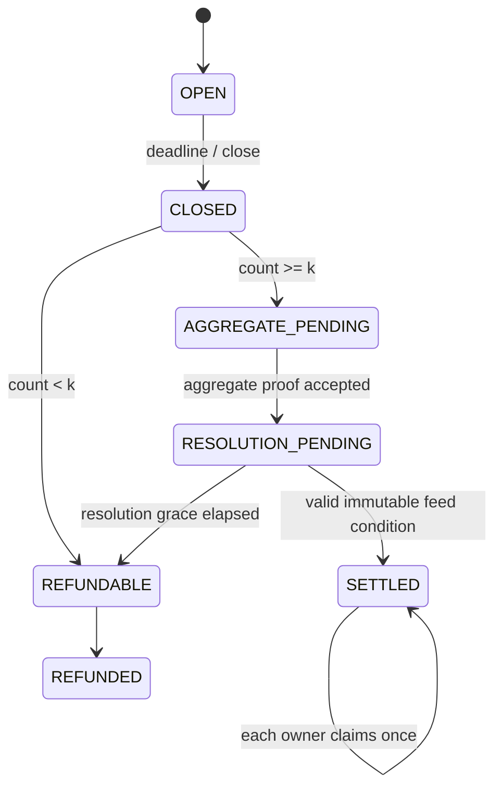

# System architecture

## Design goals

1. Privacy-critical logic lives in contracts and Nox, not in a blindly trusted backend.
2. The public resolution feed is an adapter dependency; its bytecode is not forked
   or modified.
3. The asynchronous gateway/proof lifecycle is explicit and retryable.
4. SDK, contracts, relayer, indexer, and UI have one-way dependency direction.

## Context diagram

## Module boundaries

| Module | Owns | Must not own |
|---|---|---|
| `contracts/core` | Epoch state, encrypted ledgers, ACL, settlement bounds | UI formatting, gateway calls |
| `contracts/adapters` | Narrow interface to public resolution feed | Private input decryption or asset custody |
| `modules/confidential-client` | Encryption, proof packing, ACL-safe helpers | Wallet custody, business policy |
| `modules/domain` | Pure state machine, schemas, error taxonomy | RPC side effects |
| `services/automation` | Permissionless lifecycle pokes, proof queue | Plaintext user signal, user key |
| `services/indexer` | Public events and chain-derived read model | Confidential-handle decryption |
| `apps/web` | UX, wallet, client encryption, owner decryption | Trusted settlement decisions |
| `modules/verifier` | Independent chain-data recomputation | Privileged contract calls |

## On-chain lifecycle

## Trust boundaries

- Browser ↔ Nox boundary: plaintext originates in the browser and may be processed
  only inside the attested confidential-compute boundary; it never enters an
  application-controlled backend or the public chain.
- Browser ↔ wallet: the wallet authorizes funds and transactions; the app stores no keys.
- Keeper ↔ contract: the keeper is replaceable; proof checks bound all amounts.
- Pool ↔ price feed: outcome resolution is an explicit external trust assumption;
  the adapter has no asset or outcome-writing authority.

## Availability model

Lifecycle calls are permissionless where safe. A relayer accelerates but is not a
custodian. The indexer can be rebuilt from events and is not the source of truth.
Collateral remains in confidential pool custody until a valid resolution. A feed
outage remains an explicit oracle dependency, but its immutable grace deadline leads
to a permissionless refund rather than external custody.
